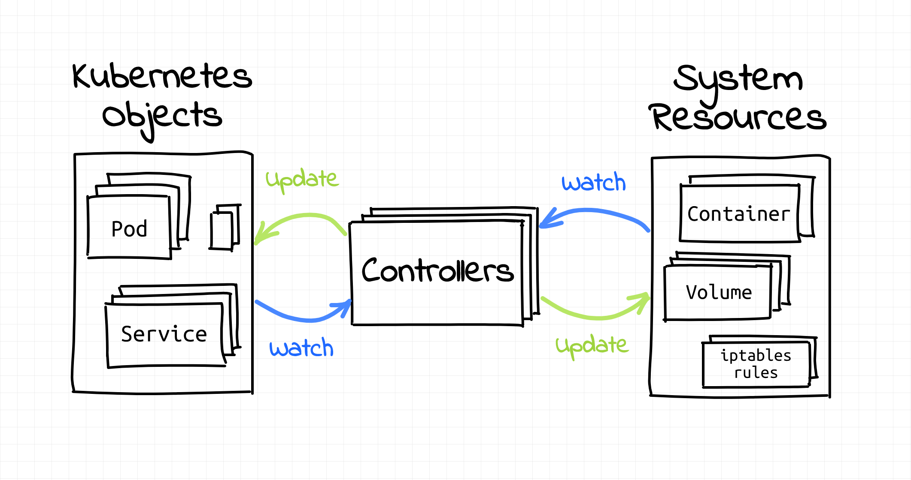

# redis-operator-without-writing-any-code



Usually, when you think about writing a k8s operator, you would probably head off to [The Operator Framework](https://operatorframework.io/) and use their operator-sdk to get started right :) Only problem is that it requires you to code in Go.

That sounds complicated. I can't code. I'm just a YAML engineer. Can I still create an operator of my own?

I'm gonna show you how in this post.
## Let's create a k8s cluster first

```bash
kind create cluster --name demo
```
To install kind, [follow the instructions here](https://kind.sigs.k8s.io/docs/user/quick-start/).

## Setup crossplane

```bash
helm repo add crossplane-stable https://charts.crossplane.io/stable
helm repo update
helm install crossplane --namespace crossplane-system --create-namespace crossplane-stable/crossplane --wait
```

```bash
# install kubectl crossplane plugin
curl -sL https://raw.githubusercontent.com/crossplane/crossplane/master/install.sh | sh
sudo mv kubectl-crossplane /usr/local/bin
```

Crossplane provider Helm: https://github.com/crossplane-contrib/provider-helm

```bash
kubectl crossplane install provider crossplane/provider-helm:master
```

Make them admin

```bash
SA=$(kubectl -n crossplane-system get sa -o name | grep provider-helm | sed -e 's|serviceaccount\/|crossplane-system:|g')
kubectl create clusterrolebinding provider-helm-admin-binding --clusterrole cluster-admin --serviceaccount="${SA}"
```

```bash
kubectl apply -f - <<EOF
apiVersion: helm.crossplane.io/v1beta1
kind: ProviderConfig
metadata:
  name: default
spec:
  credentials:
    source: InjectedIdentity
EOF
```

## Create a new XRD type Redis

```bash
kubectl apply -f xrd/redis.yaml
```

## Create a new Redis instance

```bash
kubectl apply -f my-redis-standalone.yaml
kubectl apply -f my-redis-replication.yaml
```
